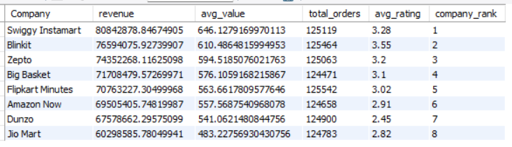
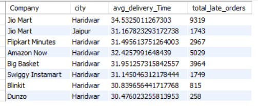
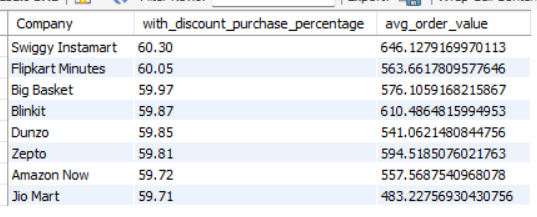
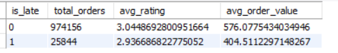
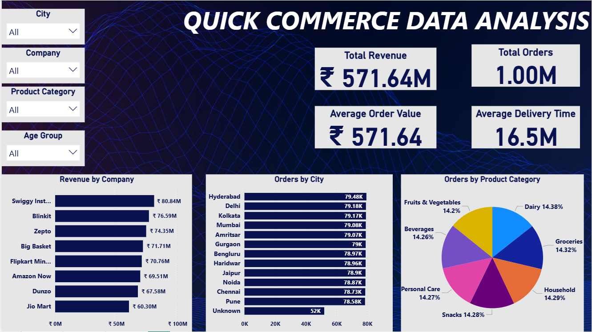
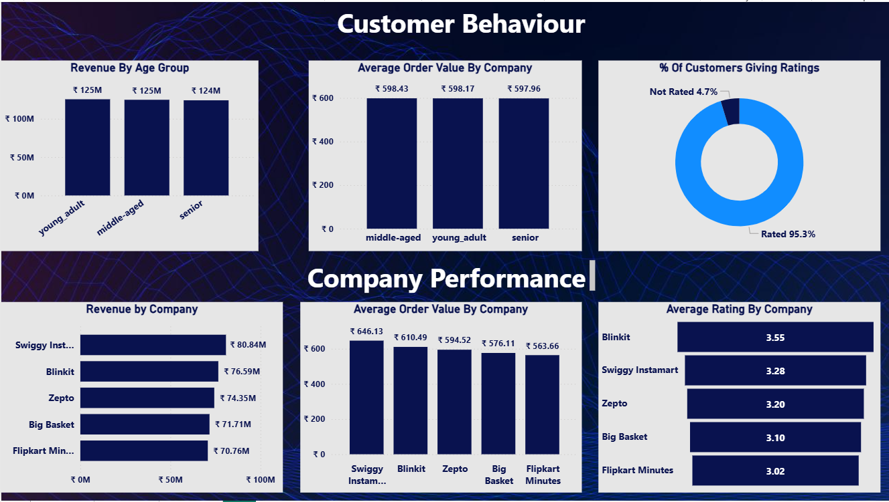

# Quick-Commerce-Business-Performance-Customer-Insights-Analysis

**Project Overview**

This project analyzes quick commerce order data to evaluate company performance, customer behavior, delivery efficiency, and the impact of discounts on sales with the objective of deriving actionable business insights and supporting data-driven decision-making.. 

**Dataset Description**  
The dataset contains transactional data from a quick commerce platform, capturing customer orders across multiple companies, cities, and product categories. It includes information related to order value, delivery performance, customer demographics, and ratings, enabling analysis of business performance, customer behavior, and operational efficiency.

**Key Features in the Dataset**

Order_ID – Unique identifier for each order

Company – Platform fulfilling the order (e.g., Blinkit, Swiggy Instamart, etc.)

City – Location where the order was placed

Customer_Age – Age of the customer

Order_Value – Total value of the order

Delivery_Time_Min – Time taken to deliver the order (in minutes)

Distance_Km – Distance covered for delivery

Items_Count – Number of items in the order

Product_Category – Category of products ordered

Payment_Method – Mode of payment used

Customer_Rating – Rating given by the customer

Delivery_Partner_Rating – Rating of delivery partner

Discount_Applied – Indicates whether a discount was applied

Age_Group – Derived feature grouping customers by age

Is_Late – Derived flag indicating delayed deliveries

Rating_Missing / Partner_Rating_Missing – Flags for missing values

 **Tools Used**

- Python (Pandas, NumPy)
 Used for data cleaning, handling missing values, feature engineering, and exploratory data analysis.

- SQL (MySQL)
 Used to perform business-driven analysis including company performance, customer segmentation, delivery efficiency, and discount impact.

- Power BI
 Used to build an interactive dashboard with KPIs, slicers, and visualizations to present key insights.
	

**Key Insights from the Analysis**

**Company-wise Performance**
	

-   Leading platforms such as Swiggy Instamart, Blinkit, and Zepto consistently outperform others in terms of revenue, order volume, and average order value across multiple cities.

**Lower Rated Companies**
    

- Companies like Dunzo and Jio Mart show consistently lower customer ratings, indicating potential issues in service quality and customer experience.
  
**Late Delivery Analysis**
  

- Jio Mart exhibits a higher number of late deliveries, reflecting operational inefficiencies in delivery performance.
- Haridwar stands out as a high-risk location for late deliveries across multiple companies, suggesting localized operational challenges.

**Discount Impact**
  

- A significant proportion (~60%) of orders are driven by discounts, indicating strong dependency on promotional strategies for sales generation.

**Delayed Delivery impact on customer satisfaction**

  
- Late deliveries are associated with lower customer ratings, highlighting delivery timeliness as a key driver of customer satisfaction.

**Dashboard-1**

**Dashboard-2**

**Business Recommendations**

Strengthen Market Leaders:
 Top-performing companies should continue expanding operations and optimizing logistics to maintain competitive advantage.

Improve Customer Experience:
 Low-rated platforms should focus on enhancing service quality, delivery reliability, and overall customer experience.

Optimize Delivery Operations:
 Companies with high late deliveries should invest in better logistics planning, route optimization, and delivery partner efficiency.

Address City-Level Challenges:
 High-delay regions like Haridwar require targeted operational strategies such as increased delivery capacity and localized infrastructure improvements.

Refine Discount Strategy:
 Companies should optimize discount usage to balance customer acquisition with profitability and reduce over-reliance on promotions.

Enhance Delivery Timeliness:
 Improving delivery speed and reliability is critical to boosting customer satisfaction and retention
